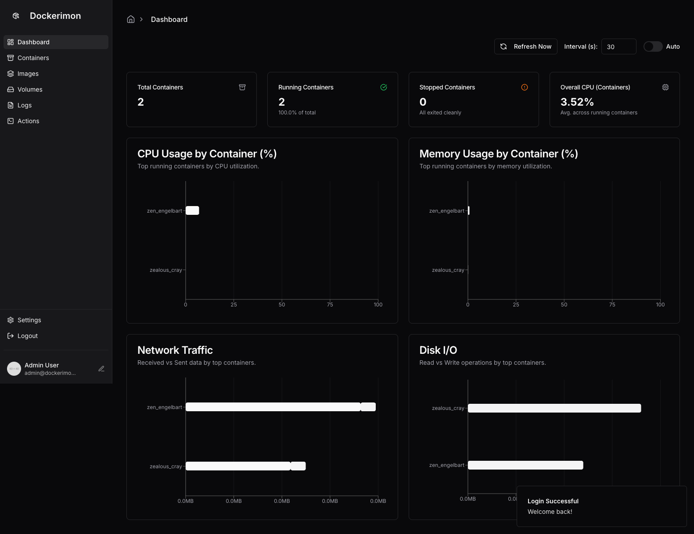
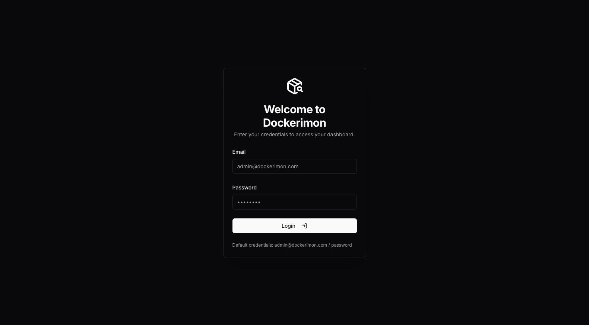
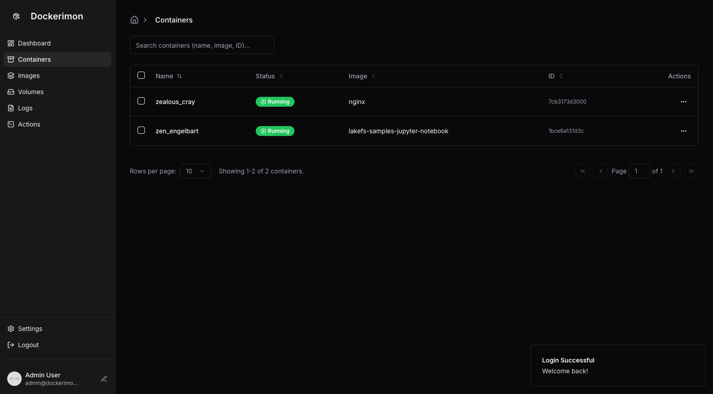
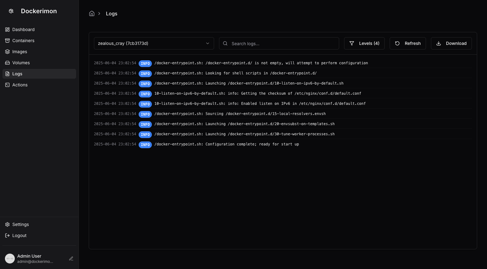

# Dockerimon

Dockerimon is a container monitoring platform built on Google Firebase Studio. By integrating the Docker Engine API, Dockerimon provides a comprehensive, real-time visualization of container and system resource metrics, enabling enterprises to quickly understand container status and optimize operational efficiency.

---

## Key Features

1. **Dashboard Overview**
   - Displays total container count, running container count, and stopped container count
   - Real-time trends for overall CPU and memory utilization
   - Ranked view of resource usage per container (CPU, memory, network traffic, disk I/O)

2. **Container Management**
   - Lists all running and stopped containers
   - Supports search and filter by container name, image, or ID
   - One-click actions: start, stop, restart, or remove containers
   - Detailed container information: image version, command, mounted volumes, network settings

3. **Image & Volume Management**
   - Displays all locally downloaded images, including size and creation timestamp
   - Keyword search for images
   - View and delete unused images and dangling volumes

4. **Real‐Time Log Viewer**
   - Streams live logs for a specified container
   - Customizable filters (log level, keywords) to pinpoint issues quickly

5. **User Authentication & Access Control**
   - Email/password login mechanism (default credentials: `admin@dockerimon.com` / `password`)
   - Administrators can add/remove users and assign or restrict container management permissions based on roles

---

## Quick Start

1. **Clone the Repository**
    ```bash
    git clone https://github.com/YourOrg/dockerimon.git
    cd dockerimon
    ```

2. **Install Dependencies**
    ```bash
    npm install
    ```

3. **Run in Development Mode**
    ```bash
    npm run dev
    ```
    - Open your browser and navigate to `http://localhost:3000` to access the Dockerimon dashboard.
    - By default, the application will attempt to connect to the local Docker Engine API. To connect to a remote Docker host, set the environment variables `DOCKER_HOST`, `DOCKER_CERT_PATH`, and other relevant parameters.

4. **Run in Production Mode**
    ```bash
    # Build static assets
    npm run build

    # Start the server
    npm run start
    ```
    - To deploy the frontend on Firebase Hosting, install the Firebase CLI and initialize Hosting:
      ```bash
      firebase login
      firebase init hosting
      ```
    - Deploy to Firebase:
      ```bash
      firebase deploy --only hosting
      ```

---

## Screenshots

  
> The Dashboard provides an at-a-glance view of resource usage, including container counts, utilization metrics, and I/O traffic.

  
> Users authenticate via email/password. Default credentials: `admin@dockerimon.com` / `password`.

  
> Lists all running containers with corresponding image, and supports search, filtering, and action buttons.

  
> Streams live logs for a specified container, facilitating rapid troubleshooting.

---

## Firebase Studio Integration

This project uses the Next.js starter template provided by Firebase Studio, integrating Firebase Authentication, Firestore, and Hosting. For details on routing and initial data loading, refer to `src/app/page.tsx`.

---

## License

This project is released under the **Apache License 2.0**. See the [LICENSE](./LICENSE) file for details.

---

## 作者簡介

**劉育維（Simon Liu）**  
人工智慧解決方案領域技術專家，專注於協助企業導入生成式人工智慧、MLOps 與大型語言模型（LLM）技術，推動數位轉型與技術落地。目前擔任 **Google GenAI 領域開發者專家（GDE）**，積極透過技術文章、演講與實務經驗分享，推廣 AI 技術應用與發展。在 Medium 平台已發表超過百篇技術文章，涵蓋生成式 AI、RAG 及 AI Agent 等主題，並多次受邀擔任技術研討會講者。

LinkedIn: [https://www.linkedin.com/in/simonliuyuwei/](https://www.linkedin.com/in/simonliuyuwei/)

---
